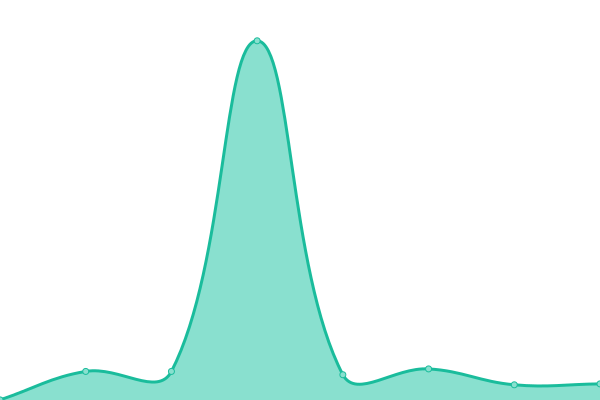

# [📈 Live Status](https://status.pivrous.wtf): <!--live status--> **🟩 All systems operational**

This repository contains the open-source uptime monitor and status page for [Pierre Averous](https://status.pivrous.wtf), powered by [Upptime](https://github.com/upptime/upptime).

With [Upptime](https://upptime.js.org), you can get your own unlimited and free uptime monitor and status page, powered entirely by a GitHub repository. We use [Issues](https://github.com/piaverous/status/issues) as incident reports, [Actions](https://github.com/piaverous/status/actions) as uptime monitors, and [Pages](https://status.pivrous.wtf) for the status page.

<!--start: status pages-->
<!-- This summary is generated by Upptime (https://github.com/upptime/upptime) -->
<!-- Do not edit this manually, your changes will be overwritten -->
<!-- prettier-ignore -->
| URL | Status | History | Response Time | Uptime |
| --- | ------ | ------- | ------------- | ------ |
|  [Pivrous Blog](https://pivrous.wtf/) | 🟩 Up | [pivrous-blog.yml](https://github.com/piaverous/status/commits/HEAD/history/pivrous-blog.yml) | 

 506ms
     
 | 

<a href="https://status.pivrous.wtf/history/pivrous-blog">100.00%</a>
    

|  [JellyFin](https://netflix.pivrous.wtf) | 🟩 Up | [jelly-fin.yml](https://github.com/piaverous/status/commits/HEAD/history/jelly-fin.yml) | 

 771ms
     
 | 

<a href="https://status.pivrous.wtf/history/jelly-fin">100.00%</a>
    

|  [Bernachon API](https://europe-west6-bernachon-2021.cloudfunctions.net/bernachon-api/) | 🟩 Up | [bernachon-api.yml](https://github.com/piaverous/status/commits/HEAD/history/bernachon-api.yml) | 

 200ms
     
 | 

<a href="https://status.pivrous.wtf/history/bernachon-api">100.00%</a>
    

|  [Telegram Bot - Lotus In Shape](https://script.google.com/macros/s/AKfycbwyDBaYg_7f37_JJ8q9FLE1QH0O0EWAnwRdj0ZTP1_QFA6TNLqPjE9wTPVHCKw3goDpUQ/exec) | 🟩 Up | [telegram-bot-lotus-in-shape.yml](https://github.com/piaverous/status/commits/HEAD/history/telegram-bot-lotus-in-shape.yml) | 

 823ms
     
 | 

<a href="https://status.pivrous.wtf/history/telegram-bot-lotus-in-shape">100.00%</a>
    

|  [Mail Bot - Hypnoticus](https://script.google.com/macros/s/AKfycbwx3nl5T7pkQFWoR8Dx_wclWltXJVvNGasvQUChHK1emB-kbbgWyEXGuIMoIimL-Zp0sQ/exec) | 🟩 Up | [mail-bot-hypnoticus.yml](https://github.com/piaverous/status/commits/HEAD/history/mail-bot-hypnoticus.yml) | 

 714ms
     
 | 

<a href="https://status.pivrous.wtf/history/mail-bot-hypnoticus">100.00%</a>
    

<!--end: status pages-->

[**Visit our status website →**](https://status.pivrous.wtf)

## 📄 License

- Powered by: [Upptime](https://github.com/upptime/upptime)
- Code: [MIT](./LICENSE) © [Pierre Averous](https://status.pivrous.wtf)
- Data in the `./history` directory: [Open Database License](https://opendatacommons.org/licenses/odbl/1-0/)
